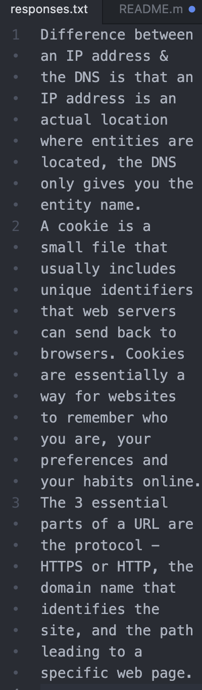

# Read Me Heading?
Three things that I've learned in this class - Honestly everything that we've done in here is brand new to me but the three things that stick out are the coding, I've never done anything like this before; what a cookie is, I've seen it pop up on my computer before but never understood its purpose; and what VCS are, I didn't know that they allow for collaboration and that you can also use them to revert back to a previous version if something breaks in your current code.

[My Responses](./responses.txt)

