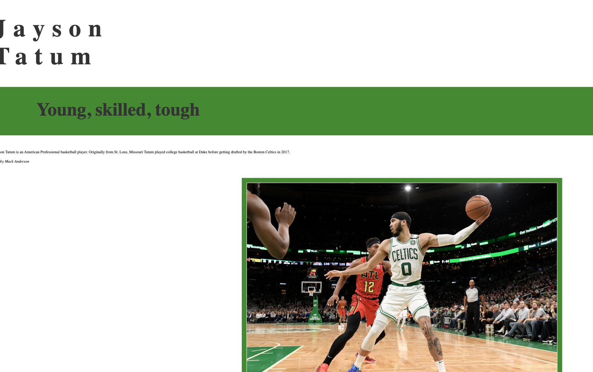

what is typography
    Typography is the art and technique of arranging type to make written language legible, readable, and appealing when displayed.

importance of having fallback fonts or a font stack
    Fallback fonts are used when there is a character that is not part of the repertoire of any of the other available fonts. It's important to have these because if you are trying to type something and you don't have the character in your font you are able to still use that character.

The difference between a system font, web font, and web-safe font
    System fonts are fonts that are already installed on your computer. Web fonts are used when building a blog or website and instruct your site to render text in a particular font. Web safe fonts are probably the most versatile of the 3 because they can adapt to any browser on any device. Developers are guaranteed that their font will work on any computer or device.

  
  
